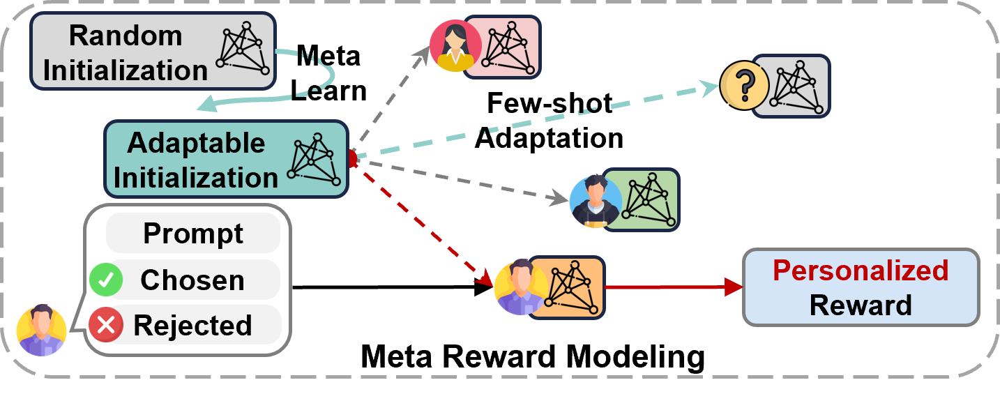
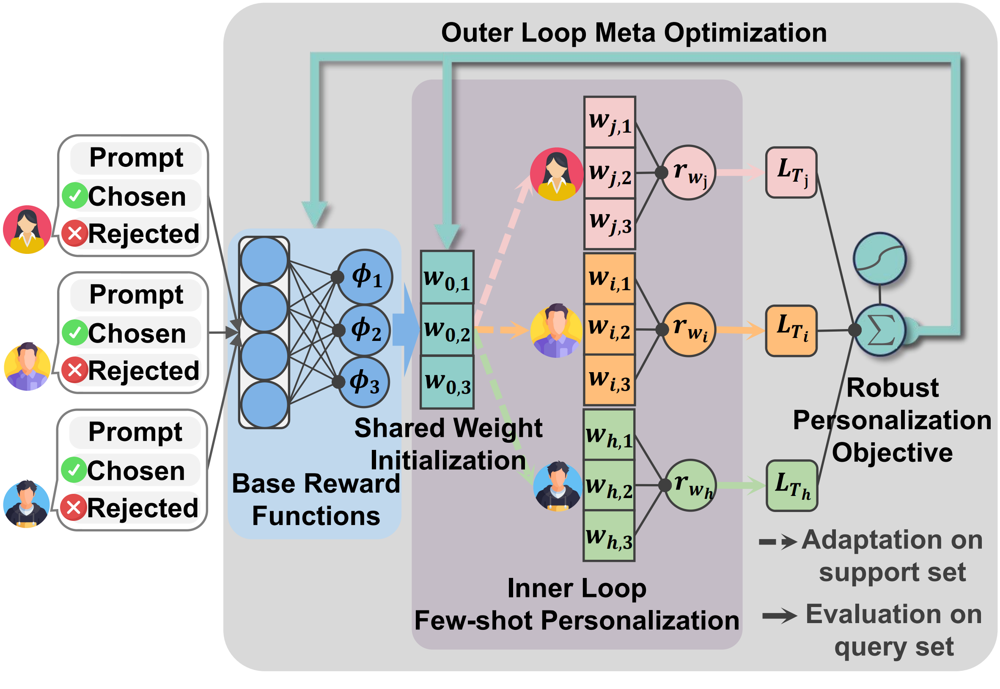

<a name="readme-top"></a>

<div align="center">
  <h1 align="center">One Adapts to Any: Meta Reward Modeling for Personalized LLM Alignment</h1>
</div>

<div align="center">

  <!-- Paper Link -->
  <a href="{paper_url}">
    
  </a>

  <a href="https://huggingface.co/papers/">
    
  </a>

  <!-- HuggingFace Models -->
  <a href="{huggingface_url}">
    
  </a>


</div>


<div align="center">
  <figure>
    
    <br>
    <figcaption><em>Quick Overview of Meta Reward Modeling.</em></figcaption>
  </figure>
</div>

Welcome to Meta Reward Modeling (MRM)! 👋
MRM is a research-oriented framework for personalized reward modeling and alignment of Large Language Models (LLMs). It is designed to study how reward models can efficiently adapt to diverse user preferences under sparse feedback and generalize to unseen users. The framework follows a clean and modular design, making it easy to prototype, extend, and evaluate personalized alignment methods.

This project provides a full implementation of MRM, where each user’s preference learning is treated as a separate task. It includes MAML-style training pipelines, few-shot user adaptation, robust optimization objectives for hard-to-learn users, and reproducible evaluation scripts for user-level performance analysis.

### 🪐 Key Features

🧭 **Meta-Learned Personalized Reward Initialization**: Treats each user as a separate task and learns a shared reward initialization that can quickly adapt to new users with only a few preference examples.

🌌 **Robust Training for Diverse User Preferences**: Uses a robust personalization objective that focuses more on hard-to-model users, improving performance consistency across diverse and long-tail preferences.

🧩 **Lightweight and Modular Reward Design**: Represents user rewards with low-dimensional adaptive weights over shared components, enabling efficient personalization, clean ablations, and easy extension.


## 🔥 News 

<div style="max-height: 240px; overflow-y: auto;">

- **[2026.01]** 🎉🎉Initial release of the project.

</div>


## 📑 Table of Contents <span id="table-of-contents"></span>


* <a href='#quick-start'>🚀 Quick Start</a>
  * <a href='#installation'>Installation</a>
  * <a href='#data'>Data</a>
  * <a href='#running'>Running</a>
* <a href='#how-it-works'>✨ How It Works</a>
* <a href='#acknowledgements'>🌱 Acknowledgements</a>
* <a href='#citation'>📚 Citation</a>


## 🚀 Quick Start <span id="quick-start"></span>


### 1. Installation <span id="installation"></span>

The code is tested on Python 3.10.0, PyTorch 2.4.0 and CUDA 12.5. 

You can create a conda environment with the required dependencies using the provided `requirements.txt` file.

```bash 
conda create -n mrm python=3.10 -y
conda activate mrm
pip install -r requirements.txt
pip install flash-attn --no-build-isolation
```

### 2. Data Preparation <span id="data"></span>

1. The dataset used in the paper is the [PRISM](https://huggingface.co/datasets/HannahRoseKirk/prism-alignment) dataset and the [Reddit TLDR](https://huggingface.co/datasets/openai/summarize_from_feedback) dataset.
2. Run the following command to download and preprocess the data to generate the embeddings:

For PRISM:
```bash
python scripts/preprocess_prism.py \
  --model_path Skywork/Skywork-Reward-V2-Llama-3.1-8B \
  --save_prefix data/emb/prism/V2 \
```
For Reddit TLDR:
```bash
python scripts/preprocess_reddit.py \
  --model_path Skywork/Skywork-Reward-V2-Llama-3.1-8B \
  --save_prefix data/emb/reddit/V2
```
> [!NOTE]
> Change the model path to 'Skywork/Skywork-Reward-Llama-3.1-8B-v0.2' if you want to use the V1 version of the reward model for preprocessing.

### 3. Running <span id="running"></span>


#### **Training**

After data preparation, you can start training the meta reward model using the following command:
for PRISM:
```bash
bash scripts/train_prism.sh
```

for Reddit TLDR:

```bash
bash scripts/train_reddit.sh
```
Both scripts will train the model with our default hyperparameters, and evaluate the model on the test set after predefined intervals. Also, logs and model checkpoints will be saved under the `outputs/` directory.

> [!NOTE]
> 1. Our training pipelines include automatic evaluation and checkpointing, so typically you do not need to run the evaluation script.
> 
> 2. You can modify the hyperparameters in the training scripts as needed. For example, change the 'seen_train_limit' to 100 to replicate the results of Reddit TLDR with 100 training samples per user.
>
> 3. If you want to skip the training phase and directly evaluate with our pretrained checkpoints. Download from [here](https://huggingface.co/HannahRoseKirk/mrm-checkpoints).

#### **Evaluation**

After training, you can evaluate the saved model checkpoints using the following commands:
For PRISM:
```bash
bash scripts/test_prism.sh
```
For Reddit TLDR:
```bash
bash scripts/test_reddit.sh
```

> [!IMPORTANT]
> 1. As every training run will randomly split the users and samples, please make sure to use the same setting (inner epoch, inner leaerning rate, and random seed) with the training phase when doing evaluation for consistent results.
>
> 2.For our released checkpoints, please refer to the provided inference scripts for the exact hyperparameters used.


## ✨ How It Works <span id="how-it-works"></span>

Meta Reward Modeling is a modular framework for personalized reward modeling, designed to learn rewards that can quickly adapt to individual users from limited preference data.
The method separates shared reward structure from user-specific adaptation, enabling few-shot personalization and robust generalization to unseen users.

At a high level, the workflow proceeds as follows:

1. Preference Representation — Each response is scored using shared base reward functions, producing feature-level reward signals that are common across users.

2. Meta-Learned Personalization — A shared initialization of user-specific weights is learned across users. For each user, these weights are adapted with a few gradient steps using their own preference data.

3. Robust Meta Optimization — During training, user-level losses are reweighted to focus more on hard-to-model users, ensuring stable performance across diverse and long-tail preferences.

<div align="center"> <figure>  <br> <figcaption><em>Overview of Meta Reward Modeling.</em></figcaption> </figure> </div>


## 🌱 **Acknowledgements** <span id="acknowledgements"></span>

We would like to thank the contributors, open-source projects, and research communities whose work made **Meta Reward Modeling** possible. 

[](https://huggingface.co/collections/Skywork/skywork-reward-model)
[](https://huggingface.co/collections/Skywork/skywork-reward-v2)
[](https://huggingface.co/datasets/HannahRoseKirk/prism-alignment)
[](https://huggingface.co/datasets/openai/summarize_from_feedback)
[](https://github.com/facebookresearch/LoRe)
[](https://pytorch.org/)
[](https://github.com/huggingface/transformers)

This project is licensed under the **MIT License**. Please refer to the LICENSE file for more details.

### 🔗 Related Projects

<div align="center">

<table>
<tr>
<td align="center">
  <b>🌟 PersonalWAB</b><br/>
  <a href="https://hongrucai.github.io/PersonalWAB/">Project Pgae</a>
</td>
<td align="center">
  <b>🚀 LoRe</b><br/>
  <a href="https://github.com/facebookresearch/LoRe">Code</a>
</td>
<td align="center">
  <b>🔧 SynthesizeMe</b><br/>
  <a href="https://github.com/SALT-NLP/SynthesizeMe">Code</a>
</td>
</tr>
</table>

</div>


## 📚 **Citation** <span id="citation"></span>

If you use **Meta Reward Modeling** in your research or applications, please consider citing:

```bibtex
@article{yourproject2025,
  title        = {{Project Name}: {Short descriptive subtitle}},
  author       = {Your Name and Collaborator Name and Others},
  journal      = {arXiv preprint arXiv:{xxxx.xxxxx}},
  year         = {2025}
}
```

<div align="center">

<a href="https://github.com/ModalityDance/MRM">
  
</a>

<a href="https://github.com/ModalityDance/MRM/issues">
  
</a>

<br/>
⭐ <b>Thank you for visiting Meta Reward Modeling!</b> ⭐

</div>
